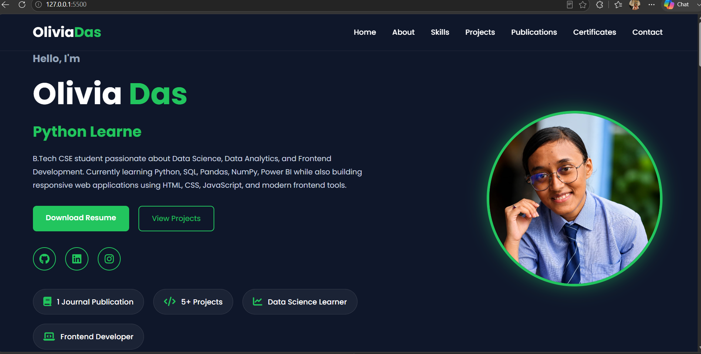
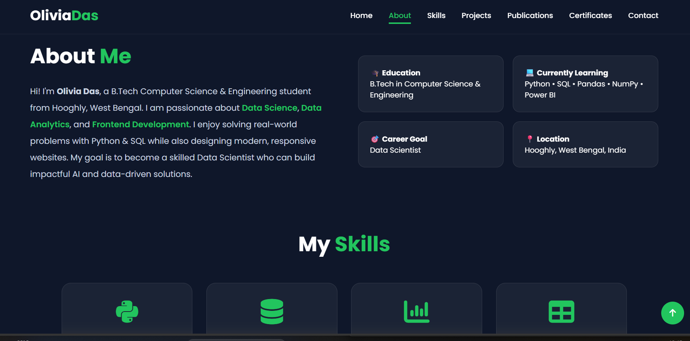
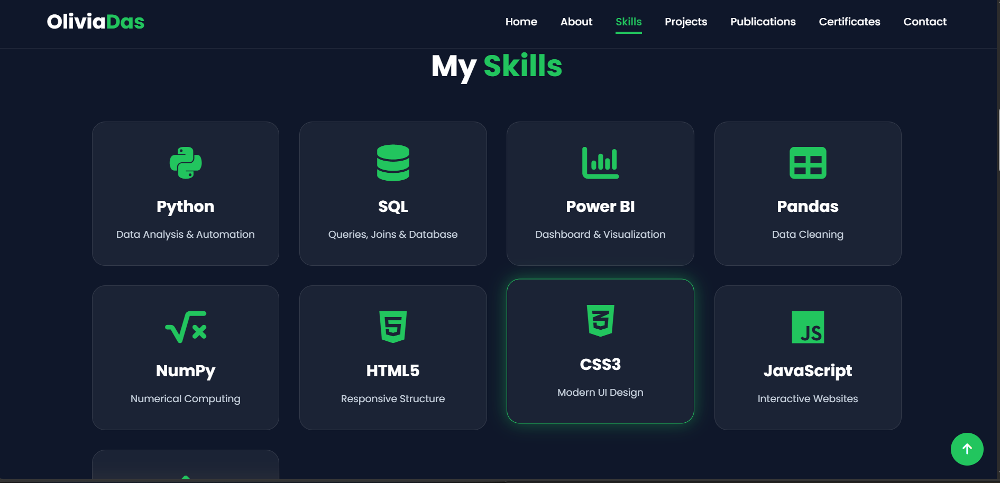
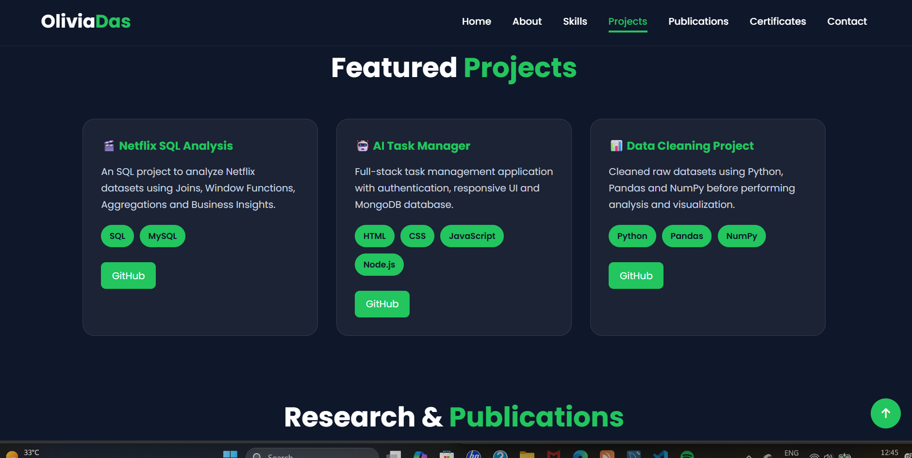
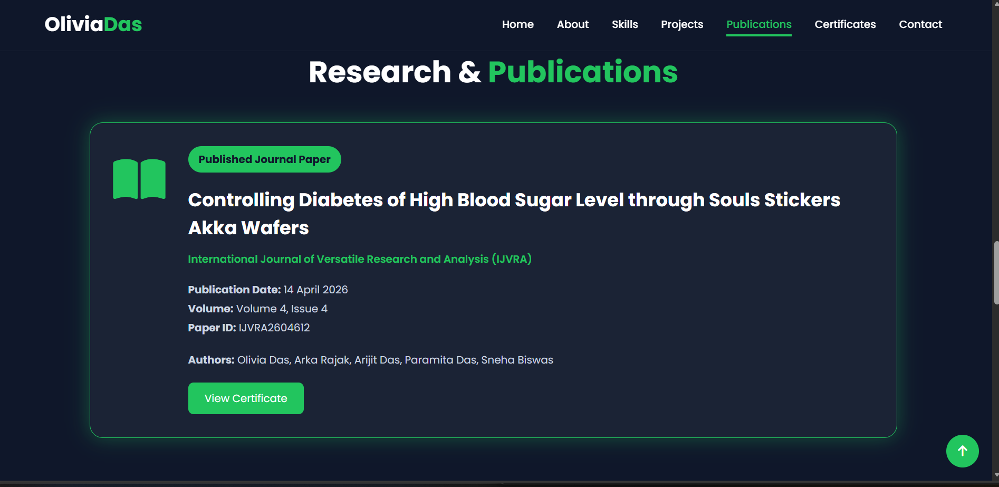
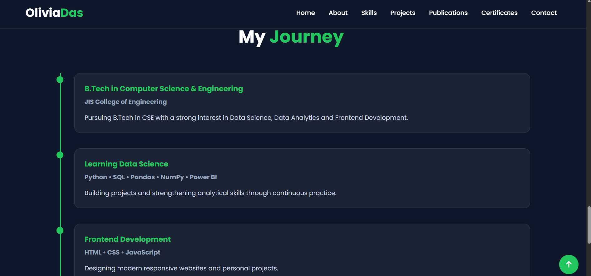
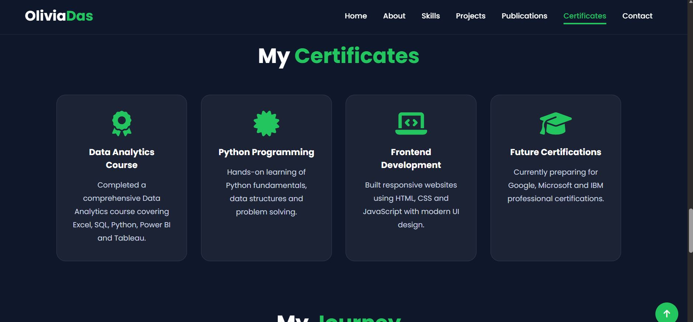
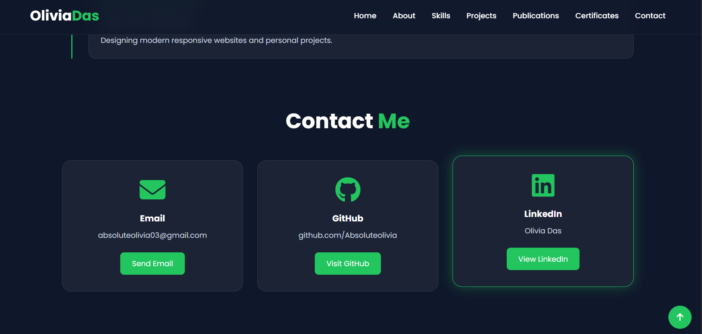

# 🌐 Olivia Das | Personal Portfolio

Welcome to my personal portfolio repository! This portfolio showcases my skills, projects, research publication, certificates, and journey as a Computer Science & Engineering student.

---

# 📸 Portfolio Preview

## 🏠 Home

## 👩‍💻 About

## 💻 Skills

## 🚀 Projects

## 📄 Research Publication

## 📝 Journal

## 🏆 Certificates

## 📬 Contact

---

# 👩‍💻 About Me

Hi! I'm **Olivia Das**, a B.Tech CSE student passionate about **Data Science, Data Analytics, Frontend Development, and Machine Learning**. I enjoy building modern web applications and solving real-world problems with data.

---

# 🚀 Features

- Responsive Portfolio Website
- Animated Navigation Bar
- Dark Theme
- Research & Publications
- Projects Showcase
- Certificates Section
- Contact Section
- Resume Download
- Back To Top Button

---

# 🛠️ Tech Stack

- HTML5
- CSS3
- JavaScript
- Python
- SQL
- Pandas
- NumPy
- Power BI
- Git & GitHub

---

# 📂 Featured Projects

- 🎬 Netflix SQL Analysis
- 🤖 AI Task Manager
- 📊 Data Analytics Projects
- 🌐 Personal Portfolio Website

---

# 📄 Research Publication

**Published in:** International Journal of Versatile Research and Analysis (IJVRA)

---

# 📫 Contact

📧 Email: **absoluteolivia03@gmail.com**

💼 LinkedIn:  
https://www.linkedin.com/in/olivia-das-b7b706282/

🐙 GitHub:  
https://github.com/Absoluteolivia

---

⭐ If you like this project, don't forget to leave a ⭐ on the repository!